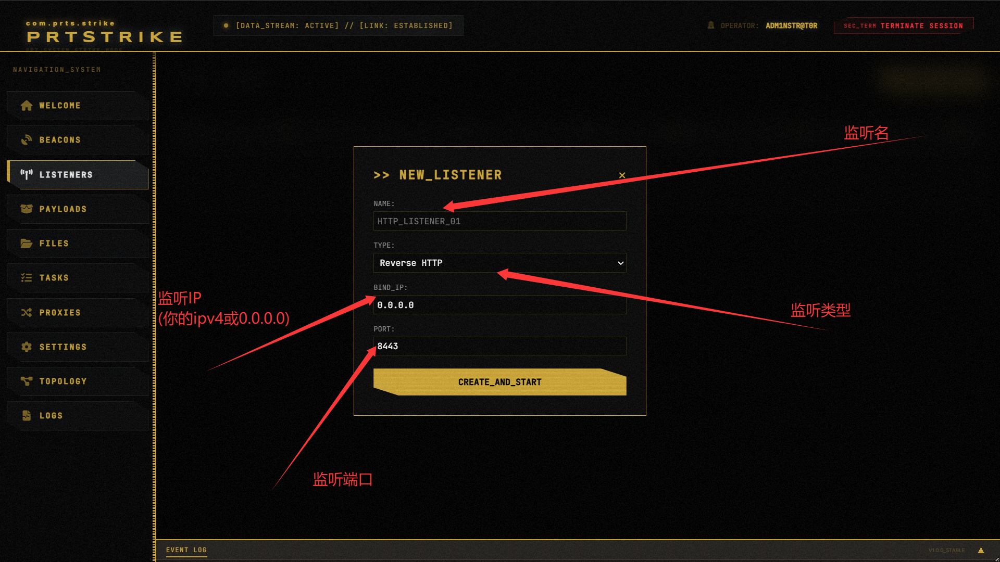
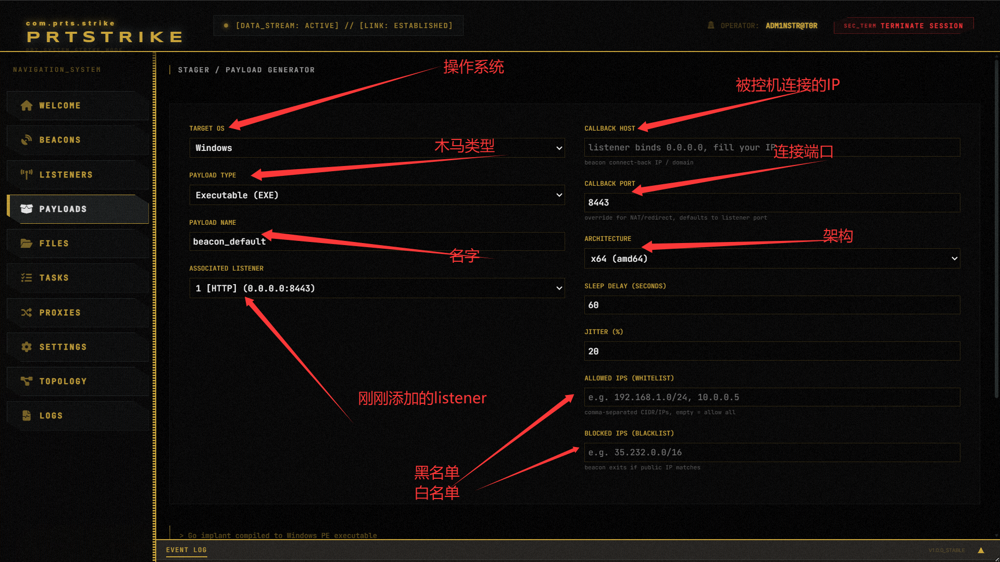
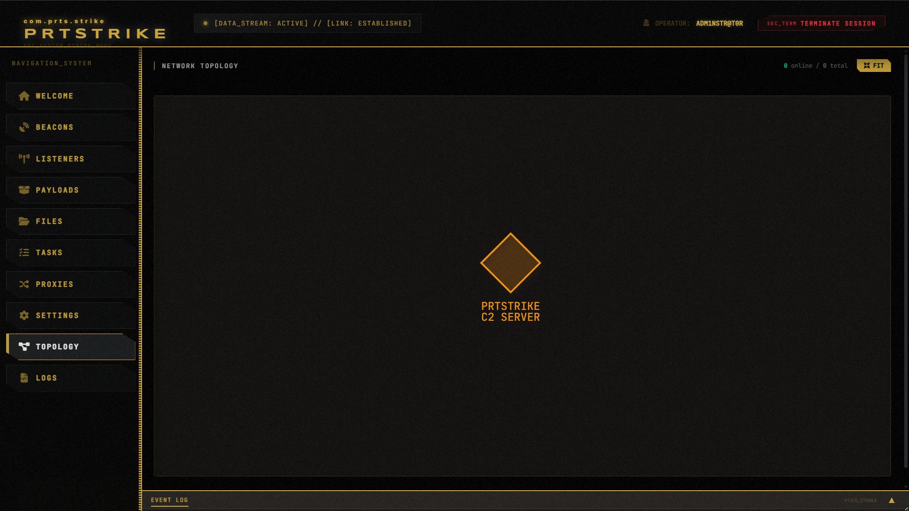

# PRTSTRIKE — Light · Small · Quick


> **Note：请务必完整看完此 README 再使用本工具。**


---

## 0x01 Introduction

PRTSTRIKE 是一个轻便、小巧、快捷的轻量化 C&C 框架，由 **Go** 编写，最快可 **1 分钟**部署完成。

| 指标 | 数值 |
|------|------|
| C2 Server 编译大小 | ~30 MB |
| Implant 编译大小 (Windows x64) | ~3 MB |
| 支持平台 | Windows / Linux / macOS |
| 通信协议 | HTTP / TCP |

---

## 0x02 Quick Start

### 方式一：源码运行

```bash
git clone https://github.com/Team-intN18-SoybeanSeclab/prtstrike.git
cd prtstrike
go run .
```

### 方式二：Docker 部署

```bash
docker build -t prtstrike .
docker run -d -p 8083:8083 --name prts prtstrike
```

---

## 0x03 Features

1. **多协议通信** — HTTP / TCP 双通道
2. **拓扑图** — 可视化网络拓扑
3. **屏幕截图** — 远程截屏（BMP 编码，体积更小）
4. **文件浏览器** — 本地 + 远程文件管理（分块上传 / Range 下载）
5. **Payload 生成** — 多种格式一键生成
   - EXE / ELF（Go 编译）
   - PowerShell / Python / Bash 脚本
   - BIN / RAW（原始 PE 字节）
   - Shellcode 源码（C / C# / Go RunPE Loader）
6. **回连过滤**
   - 黑/白名单 IP / CIDR 过滤
   - 沙箱检测（开机时间、硬件规格、分析工具进程）
---

## 0x04 Precautions

- 首次使用时，建议配置 Go 代理：
  ```bash
  go env -w GO111MODULE=on
  go env -w GOPROXY=https://goproxy.cn,direct
  ```

- 运行环境仅需 [Golang](https://golang.google.cn/)（Docker 方式无需本地安装）

- 默认端口为 **8083**，可在 `main.go` 中修改

- 默认账户 `Adm1nstr@t0r`，密码 `Pr3c1se5!@#$%`，**务必部署后在 Settings 处修改**

- 隧道功能依赖 [Chisel](https://github.com/jpillora/chisel)，需下载二进制放入 `tools/` 目录

---

## 0x05 How to Use

1. 启动：`go run .`
2. 访问：`http://[IP]:8083`
3. 登录：使用默认账户 `Adm1nstr@t0r` / `Pr3c1se5!@#$%`
4. 添加监听：点击 **LISTENER** → 新建
   
5. 生成木马：点击 **PAYLOADS** → 选择类型生成
   
6. 内网穿透：监听填内网 IP:Port，Payload 填穿透公网 IP:Port
7. 查看拓扑：在 **TYPOLOGY** 页面查看
   

---

## 0x06 Disclaimer

1. 您的下载、安装、使用或修改本工具及相关代码，意味着您对本工具的信任。
2. 本工具在使用过程中可能对您或他人造成损失或伤害，若发生此类情况，我们不承担任何责任。
3. 如果您因使用本工具而从事任何非法行为，您将自行承担一切后果，并且我们不承担任何法律责任或连带责任。
4. 请在使用前，仔细阅读并充分理解所有条款，特别是关于责任免除或限制的条款，并自行决定是否接受。
5. 除非您已经完全理解并接受所有条款，否则您无法下载、安装或使用本工具。
6. 您的任何下载、安装或使用行为，均视为您已完全阅读并同意本协议条款。
